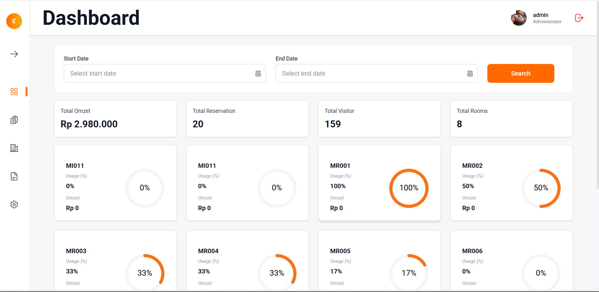
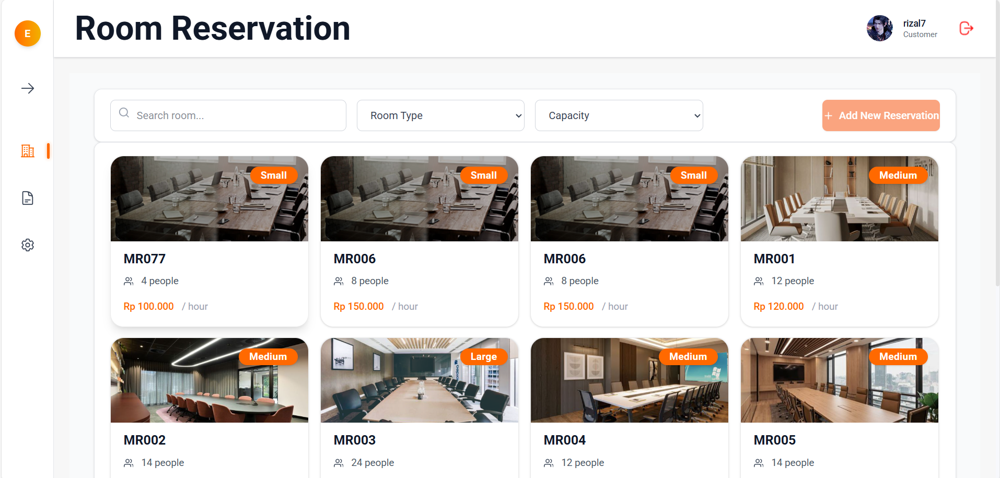

# E-Meeting – Modern Room Reservation (React.js)

A professional and responsive room reservation and management app built with React.js.  
Created as a portfolio project in my journey to switch career from senior marketing in Consumer Good, Beverage, and Agriculture to modern Frontend Engineering.

[Demo Live on Vercel](https://my-project-ashy-one.vercel.app/)

---

## ✨ Features

- Responsive dashboard, multi-page navigation (Rooms, Reservations, History, User Settings)
- Room booking flow with grid, filter, search, and UX-first pagination
- End-to-end reservation: schedule, snack & package selection, instant summary
- History/report page – filterable, exportable, with clean paging
- Authentication & role management, avatar/profile editing
- Figma-based layout, pixel-perfect and modern SaaS UI

---

## 💻 Tech Stack

- React.js (Functional + Hooks)
- TailwindCSS & custom responsive styling
- Modular API (fetch, Axios ready)
- Context API for state management
- React Datepicker, React Icons, Toastify
- Figma design system realization
- Deployed: Vercel

---

## 🚀 Getting Started

1. **Clone the Repository**
git clone https://github.com/afrizal090477-max/My-Project.git
cd My-Project

2. **Install Dependencies**
npm install

3. **Start the App Locally**
npm run dev

4. Open [http://localhost:5173](http://localhost:5173) in your browser.

---

## 🔗 Backend API Documentation

- **API Reference (OpenAPI/Swagger, No VPN needed):**  
  [https://emiting-be.vercel.app/api-docs/](https://emiting-be.vercel.app/api-docs/)

  
<i>Backend adalah layanan milik tim lain. Endpoint demo (login/daftar, dsb) bisa saja tidak aktif/404 karena di luar otorisasi saya sebagai FE. Semua integrasi, form, dan UX Frontend sudah sesuai Figma dan best practice kerja tim modern.</i>

---

## 👤 Author

**Afrizal**  
Ex-Marketing — Consumer Good, Beverage, and Agriculture  
Frontend Developer (React.js, UI/UX, SPA, deployment)

- 📧 [afrizal.090477@gmail.com](mailto:afrizal.090477@gmail.com)
- 🔗 [LinkedIn - Afrizal Yakub](https://www.linkedin.com/in/afrizal-yakub-158083116/)
- 💼 [Github Portfolio](https://github.com/afrizal090477-max/My-Project)
- 🌐 [Live Demo on Vercel](https://my-project-ashy-one.vercel.app/)

---

## 🏆 Why Hire Me?

- Real-world, modern code (React best practices, reusable component structure, modular API)
- Strong UX attention and Figma implementation, looks great on all screens
- Business acumen: deep experience in user-centric, practical solutions from previous marketing career
- Growth Mindset: fast learner with proven project delivery, ready for real teamwork and production code

---

## 📸 Screenshots

_Main Dashboard_  

<i>Dashboard empty state: Clean handling when no data found; robust UI for all scenarios.</i>

_Reservation Flow_  

<i>Room Reservation grid: Modern UI, responsive, filterable, ready for production flows."</i>

---

> This project is a showcase of my transition to frontend engineering.  
> **Ready for my first role in your product team – let’s build something amazing together!**

